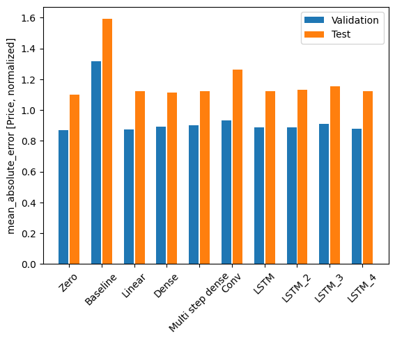

## StocksAI

[Link to deployed app](https://gonesahlin-stocksai-appsrcapp-o4ry9o.streamlit.app/)

### Overview
* Predicting percent increase of a stock over the next day
* Collects the stock’s price and quarterly financials
* Collects index data for broader view of market
* Uses time-series forecasting to take the previous 10 days to predict the next day.

### Results

None of the models were able to predict with more accuracy than the model predicting zero change.

### Potential Problems
* Inconsistencies in the stock market over the last two years of data. Previous ten years showed steady increase, but over the last two years stock prices decreased.
* Lack of data. Might be improved with more stocks, a longer time period, and more attributes.

### Instructions
#### To collect data
make collect

#### To train model
1. [install tensorflow](https://www.tensorflow.org/install/pip)
2. python model/src/train.py

#### To run app
make run-app
